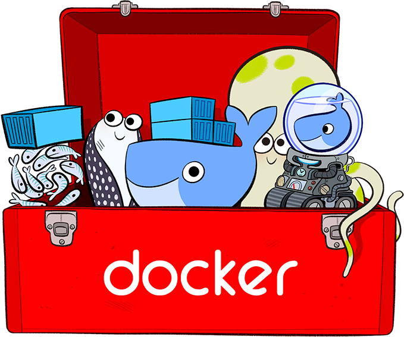
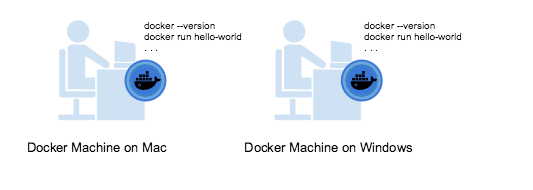

# Docker Workshop - Docker Machine



# Sections

* [Install Docker Toolbox](#install-docker-toolbox)
* [What is Docker Toolbox](#what-is-docker-toolbox)
* [What is Docker Machine](#what-is-docker-machine)
* [Why should I use it](#why-should-i-use-it)
* [Difference between Docker Engine and Docker Machine](#difference-between-docker-engine-and-docker-machine)
* [Create a docker machine running Docker](#create-a-docker-machine-running-docker)
* [Run a docker container in a docker-machine](#run-a-docker-container-in-a-docker\-machine)
* [Clean up Docker machine](#clean-up-docker-machine)
* [Create two docker machines](#create-two-docker-machines)
* [Run Nginx on docker machine1](#run-nginx-on-docker-machine1)
* [Run Nginx on docker machine2](#run-nginx-on-docker-machine2)
* [SSH into docker-machine](#ssh-into-docker\-machine)
* [Docker Machine Cleanup](#docker-machine-cleanup)
* [Bread Crumb Navigation](#bread-crumb-navigation)

## Install Docker Toolbox
_________________________

Download and install [Docker Toolbox](https://www.docker.com/docker-toolbox).

* The toolbox installs a handful of tools on Windows or Mac OS X computer.
* Docker Machine: To deploy virtual machines that run Docker Engine
* VirtualBox: To host the virtual machines deployed from Docker Machine

## What is Docker Toolbox
_________________________

[Documentation](https://docs.docker.com/toolbox/overview/#whats-in-the-box)

Docker Toolbox includes these Docker tools:

* Docker Machine for running docker-machine commands
* Docker Engine for running the docker commands
* Docker Compose for running the docker-compose commands
* Kitematic, the Docker GUI is a shell preconfigured for a Docker command-line environment
* Oracle VirtualBox

**You can find various versions of the tools on Toolbox Releases or run them with the --version flag in the terminal, for example, docker-compose --version**

## What is Docker Machine
_________________________

[Documentation](https://docs.docker.com/machine/overview/#what-is-docker-machine)

* Docker Machine is a tool that lets you install Docker Engine on virtual hosts, and manage the hosts with
    * docker-machine commands.
* You can use Machine to create Docker hosts on your local Mac or Windows box, on your company network, in
    * your data center, or on cloud providers like Azure, AWS, or Digital Ocean.
* Using docker-machine commands, you can start, inspect, stop, and restart a managed host, upgrade the
    * Docker client and daemon, and configure a Docker client to talk to your host.
* Point the Machine CLI at a running, managed host, and you can run docker commands directly on that host.
* For example, run docker-machine env default to point to a host called default, follow on-screen
    * instructions to complete env setup, and run docker ps, docker run hello-world, and so forth.
* Machine was the only way to run Docker on Mac or Windows previous to Docker v1.12.
* Starting with the beta program and Docker v1.12, Docker for Mac and Docker for Windows are available as
    * native apps and the better choice for this use case on newer desktops and laptops.
* We encourage you to try out these new apps. The installers for Docker for Mac and Docker for Windows
    * include Docker Machine, along with Docker Compose.

## Why should I use it
_________________________

* Docker Machine enables you to provision multiple remote Docker hosts on various flavors of Linux.
* Additionally, Machine allows you to run Docker on older Mac or Windows systems, as described in the previous topic.
* Docker Machine has these two broad use cases.



* I have an older desktop system and want to run Docker on Mac or Windows*

If you work primarily on an older Mac or Windows laptop or desktop that doesn’t meet the requirements for the new Docker for Mac and Docker for Windows apps, then you need Docker Machine in order to “run Docker” (that is, Docker Engine) locally. Installing Docker Machine on a Mac or Windows box with the Docker Toolbox installer provisions a local virtual machine with Docker Engine, gives you the ability to connect it, and run docker commands.

* I want to provision Docker hosts on remote systems

Docker Engine runs natively on Linux systems. If you have a Linux box as your primary system, and want to run docker commands, all you need to do is download and install Docker Engine. However, if you want an efficient way to provision multiple Docker hosts on a network, in the cloud or even locally, you need Docker Machine

## Difference between Docker Engine and Docker Machine
_________________________

When people say “Docker” they typically mean Docker Engine, the client-server application made up of the Docker daemon, a REST API that specifies interfaces for interacting with the daemon, and a command line interface (CLI) client that talks to the daemon (through the REST API wrapper). Docker Engine accepts docker commands from the CLI, such as docker run <image>, docker ps to list running containers, docker images to list images, and so on.


Docker Machine is a tool for provisioning and managing your Dockerized hosts (hosts with Docker Engine on them). Typically, you install Docker Machine on your local system. Docker Machine has its own command line client docker-machine and the Docker Engine client, docker. You can use Machine to install Docker Engine on one or more virtual systems. These virtual systems can be local (as when you use Machine to install and run Docker Engine in VirtualBox on Mac or Windows) or remote (as when you use Machine to provision Dockerized hosts on cloud providers). The Dockerized hosts themselves can be thought of, and are sometimes referred to as, managed “machines”.


## Create a docker machine running Docker
_________________________

Create and run a VM named `default` using the following command:

```bash
$ cd $(pwd)/code/docker-machine
$ docker-machine create -d virtualbox default
# if the docker-machine exists you will see this
Host already exists: "default"
```

You can list the existing docker-machines:

```bash
docker-machine ls
```

In case you already had the machine created, you can simply start the VM:

```
docker-machine start default
```

## Run a docker container in a docker-machine
_________________________

Now, let's use the docker-machine we've just created. We want to run the `hello-world`.

If you are using OS X:
```
eval $(docker-machine env default)
```

This will set the `DOCKER_HOST` variable to the IP address of your `default` `docker-machine`.

Then we should be able run the `hello-world` container:

```bash
docker run hello-world
```

## Clean up Docker machine
_________________________

Stop the docker machine named `default`:

```bash
$ docker-machine stop default
Stopping "default"...
Machine "default" was stopped.
```

Remove the docker machine named `default`:

```
$ docker-machine rm default
About to remove default
WARNING: This action will delete both local reference and remote instance.
Are you sure? (y/n): y
Successfully removed default
```

## Create two docker machines
_________________________


```bash
$ docker-machine create -d virtualbox machine1
$ docker-machine create -d virtualbox machine2
## This will take a couple of minutes or so and you will see output like this
Running pre-create checks...
Creating machine...
(machine2) Copying /Users/marcelbelmont/.docker/machine/cache/boot2docker.iso to /Users/marcelbelmont/.docker/machine/machines/
machine2/boot2docker.iso...
(machine2) Creating VirtualBox VM...
(machine2) Creating SSH key...
(machine2) Starting the VM...
(machine2) Check network to re-create if needed...
(machine2) Waiting for an IP...
Waiting for machine to be running, this may take a few minutes...
Detecting operating system of created instance...
Waiting for SSH to be available...
Detecting the provisioner...
Provisioning with boot2docker...
Copying certs to the local machine directory...
Copying certs to the remote machine...
Setting Docker configuration on the remote daemon...
Checking connection to Docker...
Docker is up and running!
To see how to connect your Docker Client to the Docker Engine running on this virtual machine, run: docker-machine env machine2
```

**You will have the driver called `virtualbox` so you need to call it this in order for it to work**

Run the command `docker-machine ls` to List Docker machines

```bash
docker-machine ls
```

## Run Nginx on docker machine1
_________________________

Copy the last line each line in particular this `docker-machine env machine1`

```bash
$ eval $(docker-machine env machine1)
## This command connects your Docker Client to the Docker Engine running on this virtual machine
$ docker run -d -p 80:80 nginx:1.8-alpine
$ docker-machine ip machine1
192.168.99.100
$ open "http://$(docker-machine ip machine1)"
```

## Run Nginx on docker machine2
_________________________

```bash
eval $(docker-machine env machine2)
docker run -d -p 80:80 nginx:1.8-alpine
docker-machine ip machine2
192.168.99.101
open "http://$(docker-machine ip machine2)"
```

## SSH into docker-machine
_________________________

SSH into docker machine1:

```bash
$ docker-machine ssh machine1
                        ##         .
                  ## ## ##        ==
               ## ## ## ## ##    ===
           /"""""""""""""""""\___/ ===
      ~~~ {~~ ~~~~ ~~~ ~~~~ ~~~ ~ /  ===- ~~~
           \______ o           __/
             \    \         __/
              \____\_______/
 _                 _   ____     _            _
| |__   ___   ___ | |_|___ \ __| | ___   ___| | _____ _ __
| '_ \ / _ \ / _ \| __| __) / _` |/ _ \ / __| |/ / _ \ '__|
| |_) | (_) | (_) | |_ / __/ (_| | (_) | (__|   <  __/ |
|_.__/ \___/ \___/ \__|_____\__,_|\___/ \___|_|\_\___|_|
Boot2Docker version 17.06.0-ce, build HEAD : 0672754 - Thu Jun 29 00:06:31 UTC 2017
Docker version 17.06.0-ce, build 02c1d87
```

**Notice the output you receive here**

```bash
docker@machine1:~$ ls
log.log
```

## Environment variables
_________________________

Docker client is configured by environment variables to connect with remote daemons.
The following command outputs the variables for connecting to previously created `default` VM.

```bash
$ docker-machine env machine1
export DOCKER_TLS_VERIFY="1"
export DOCKER_HOST="tcp://192.168.99.100:2376"
export DOCKER_CERT_PATH="/Users/marcelbelmont/.docker/machine/machines/machine1"
export DOCKER_MACHINE_NAME="machine1"
# Run this command to configure your shell:
# eval $(docker-machine env machine1)
```

## Active Machine
_________________________

To show the active docker machine name do the following command:

```bash
$ docker-machine active
machine2
```

**Notice that the last machine we provisioned is listed which is `machine2`**

## Docker Machine Cleanup
_________________________

```bash
$ docker-machine stop machine1 machine2
# You will the following output
Stopping "machine2"...
Stopping "machine1"...
Machine "machine2" was stopped.
Machine "machine1" was stopped.

$ docker-machine rm machine1 machine2
About to remove machine1, machine2
WARNING: This action will delete both local reference and remote instance.
Are you sure? (y/n): y
Successfully removed machine1
Successfully removed machine2
```

## Bread Crumb Navigation
_________________________

Previous | Next
:------- | ---:
← [Volumes](../volumes/README.md) | [Docker Swarm](../docker-swarm/README.md) →
